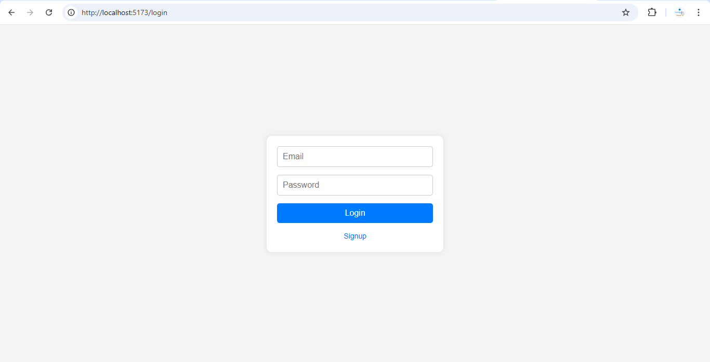
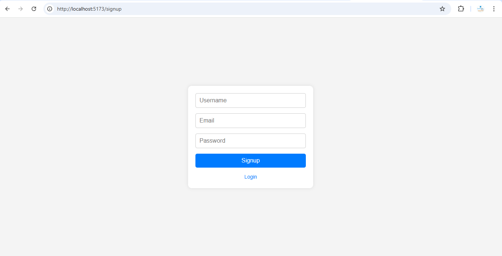
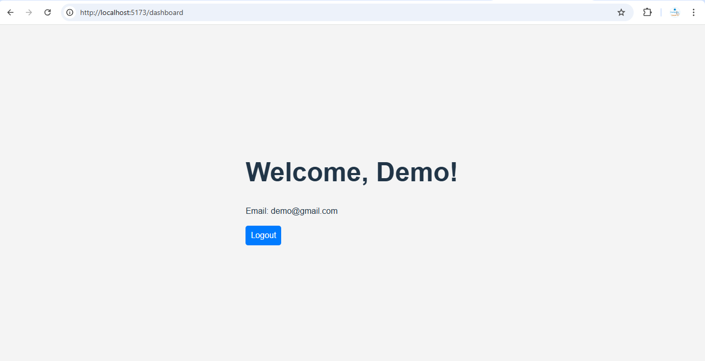

# MERN Authentication System with Dashboard

This is a full-stack **MERN** (MongoDB, Express, React, Node.js) authentication system that includes **user signup**, **login**, and a **protected dashboard**. This project demonstrates how to implement **JWT-based authentication** and provides a **dashboard page** accessible only by logged-in users.

## Features

- **User Registration**: Allows new users to sign up with username, email, and password.
- **Login**: Authenticates users with email and password, then issues a JWT token.
- **Protected Dashboard**: Only accessible to users with a valid JWT token.
- **Logout**: Removes the JWT token from localStorage and redirects the user to the login page.

## 📦 Project Setup

This project consists of two parts:
1. **Backend (Node.js + Express + MongoDB)**
2. **Frontend (React + Vite)**

### 1️⃣ Backend Setup (Node.js + Express + MongoDB)

#### Prerequisites
- **Node.js** (v14 or later)
- **MongoDB** (locally or using MongoDB Atlas)

#### Steps to Setup Backend:

1. **Clone the repository**:
   ```bash
   git clone https://github.com/dpk763/Login_Signup_System.git
   cd Login_Signup_System

2. **Install dependencies: Inside the backend folder, run the following command to install the required dependencies**:
    ```bash
    npm install

3. **Configure .env file: Create a .env file in the backend folder with the following content**:
    ```env
    MONGO_URI=mongodb://localhost:27017/Users
    JWT_SECRET=your_jwt_secret_key

    - Replace your_jwt_secret_key with a secret string for signing the JWT tokens.

    - If you’re using MongoDB Atlas, replace the MONGO_URI with your Atlas connection string.

4. **Start the server: To start the backend server, run**:
    ```bash
    node server.js

    - The backend should be running on http://localhost:5000.


 ### 2️⃣ Frontend Setup (React + Vite)

**Prerequisites**
    - Node.js (v14 or later)

    - Vite (for faster build times)

1. **Navigate to the frontend directory**:
    ```bash

    cd frontend

2. **Install dependencies** : Inside the frontend folder, run the following command to install the required dependencies:
    ```bash
    npm install

3. **Start the frontend**: To run the frontend using Vite, use the following command:
    ```bash
    npm run dev

### 📝 Frontend Structure 


1. **Login**: Allows the user to log in and retrieve a JWT token.

2. **Signup**: Allows the user to register for a new account.

3. **Dashboard**: Protected page where the user can view their information after logging in.

4. **Logout**: Button that clears the JWT token and redirects the user back to the login page.


### 📈 Screenshots

**Login Page**



**SignUp Page**



**Dashboard**




### 🛠️ Technologies Used
    
1. **Backend**: Node.js, Express, MongoDB, JWT, bcryptjs

2. **Frontend**: React, Vite, React Router

3. **Authentication**: JWT (JSON Web Token)